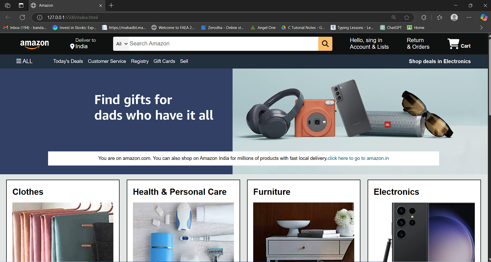

# Amazon-Clone
# 🛒 Amazon Clone (HTML + CSS)

A responsive Amazon Clone built using **HTML** and **CSS** that mimics the UI of Amazon's homepage. This project demonstrates strong front-end development skills with clean code and responsive design practices.

(ss2.png)(ss3.png)

## 🚀 Features

- ✅ Fully responsive design
- ✅ Header with logo, search bar, and navigation menu
- ✅ Hero banner section
- ✅ Product cards layout
- ✅ Footer with multiple links
- ✅ Pixel-perfect Amazon UI lookalike

---

## 🧰 Technologies Used

- HTML5
- CSS3
- Flexbox & Grid
- Media Queries for responsiveness
- Font Awesome (optional icons)

## 🏁 Getting Started

### 📦 Clone the Repository
```bash
git clone https://github.com/your-username/amazon-clone-html-css.git
cd amazon-clone-html-css
